### 主轴与交叉轴

主轴(main axis)默认情况下是从左到右的，默认是水平的，这里称为x轴

交叉轴(cross axis)默认情况下是从上到下的，默认是垂直的，这里称为y轴

```css
display: flex // 设置为弹性模型
```

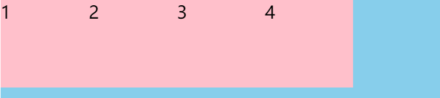

#### 改变轴的方向

```css
flex-direction: row; // 默认值从左到右
flex-direction: row-reverse; // 从右到左
```

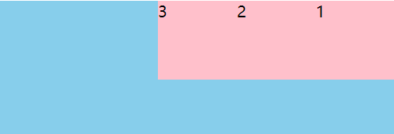


```css
flex-direction: column; // 从上到下

```
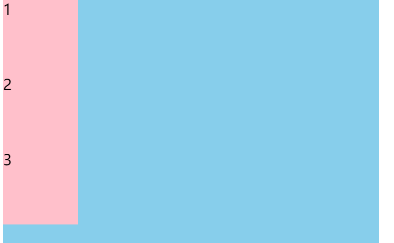

```
flex-direction: column-reverse; // 从下到上
```
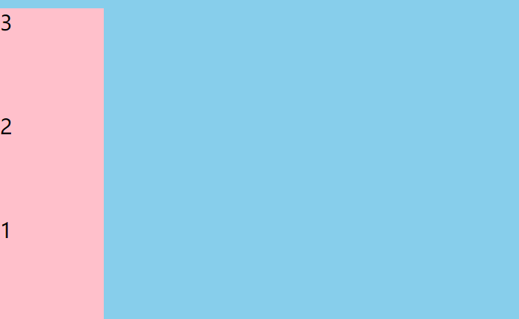


#### 换行与缩写

**当主轴为x轴时：**

当子项中未设定宽度时，以内容的宽度为准，并不会自适应容器，像浮动特性。

即弹性元素的子元素未指定宽度时，以子元素默认的内容作为宽度

当子项未设定高度时，高度自适应弹性元素的高度

**当主轴为y轴时：**

当子项中未设定高度时，以内容的高度为准，并不会自适应容器，像浮动特性。

即弹性元素的子元素未指定高度时，以子元素默认的内容作为高度

当子项未设定宽度时，高度自适应弹性元素的宽度

```css
flex-wrap: wrap; //换行，从上到下
```

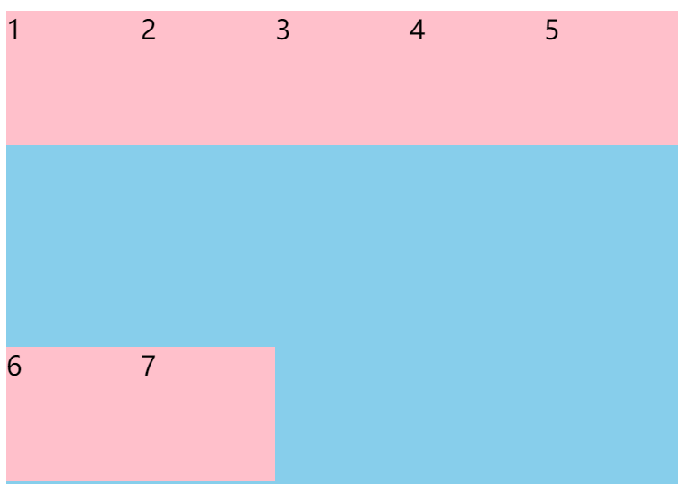


```css
flex-wrap: wrap-reverse; //换行，从下到上
```
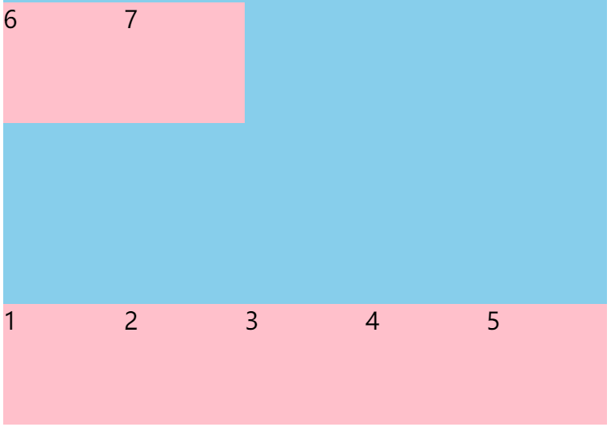


```css
flex-wrap: nowrap; // 默认值 不换行
```

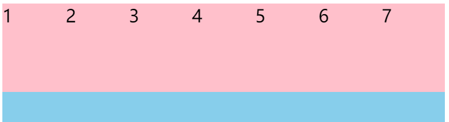


换行时，默认主轴为x轴，弹性元素会根据子元素的宽度与数量，计算出子元素宽度总和，与弹性元素的宽度取值，若有余数则向上取整，得到的结果值就是取得的行数

例如，弹性元素宽度为500，子元素数量为6，宽度为100，则分为两行，第一行5个子元素，第二行一个子元素

如果主轴为y轴，则使用高度计算	


**flex布局不适合多行的情况**，适用于一维布局


```css
flex-flow: 主轴 是否换行;
// x轴，不换行，换行，反转
flex-flow: row nowrap;
flex-flow: row wrap;
flex-flow: row wrap-reverse;

// x轴反转，不换行，换行，反转
flex-flow: row-reverse nowrap;
flex-flow: row-reverse wrap;
flex-flow: row-reverse wrap-reverse;

// y轴，不换行，换行，反转
flex-flow: column nowrap;
flex-flow: column wrap;
flex-flow: column wrap-reverse;

// y轴反转，不换行，换行，反转
flex-flow: column-reverse nowrap;
flex-flow: column-reverse wrap;
flex-flow: column-reverse wrap-reverse;


```


#### 主轴对齐

```css
justify-content: flex-start; //默认,左对齐
```


```css
justify-content: flex-end; //右对齐
```
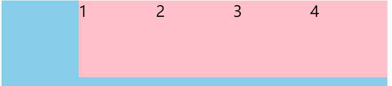

```css
justify-content: center; //居中
```
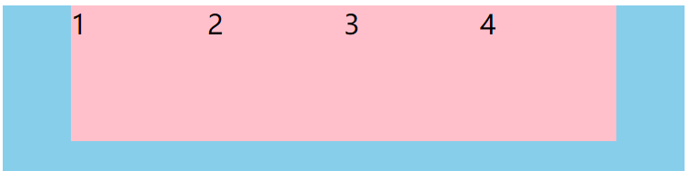

```css
justify-content: space-around; //平均分配子项的距离
```
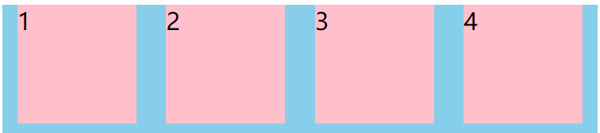

```css
justify-content: space-between; //初始与最终子项分别在弹性元素的初始位置和最终位置，其他子项平均分布
```
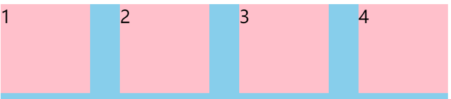


```css

justify-content: space-evenly; //子项间间距等大均分
```


#### 交叉轴对齐

`align-content`整体的影响，即使换行也是对整个所有子项的影响

当不换行的情况下，align-content是不生效的，需要开启换行`flex-wrap: wrap`

```css
align-content: stretch; //默认，拉伸,在子元素未设置高度的情况下，与弹性元素高度对齐，
```

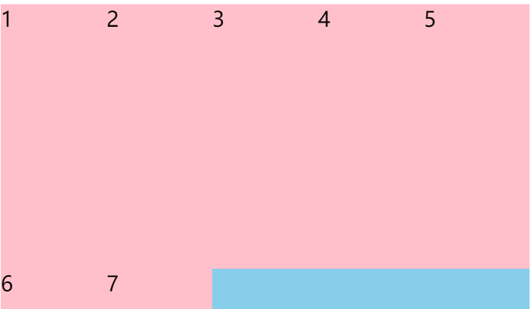

```css
align-content: stretch; //默认，拉伸,在子元素设置高度的情况下，占用弹性元素高度
```

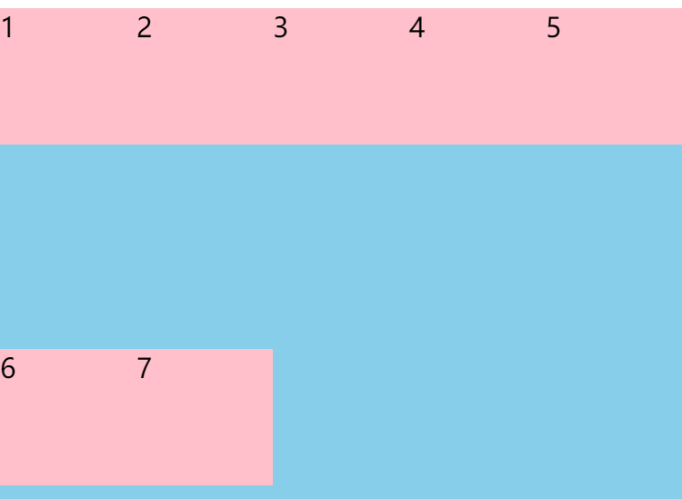

```css

align-content: flex-start; // 垂直方向位于y轴初始位置，此时子项位于弹性元素顶部

```

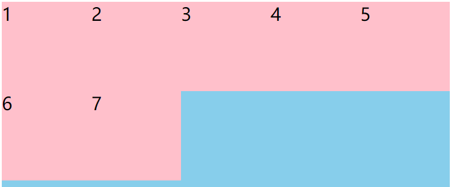

```css
align-content: flex-end; // 垂直方向位于y轴最终位置，此时子项位于弹性元素底部
```


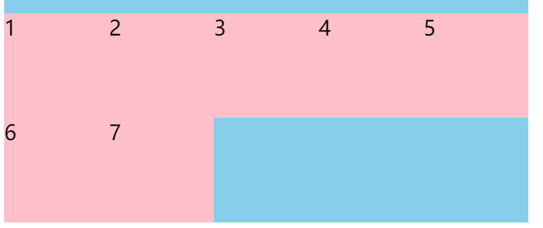

```css
align-content: center; // 垂直方向位于y轴中间位置,子项位于弹性容器中间位置

```

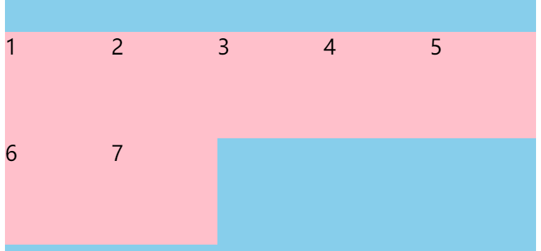

```css
align-content: space-around; // 垂直方向平均分配子项的距离
```

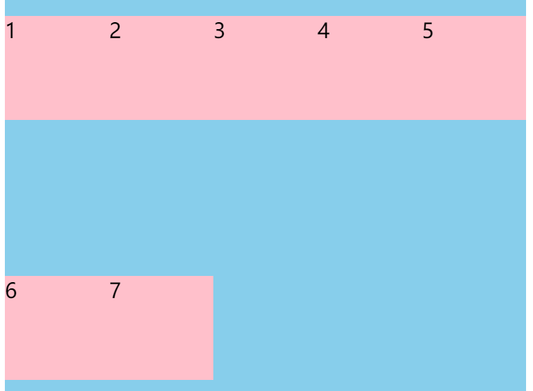

```css
align-content: space-between; // 垂直方向初始与最终子项分别在弹性元素的初始位置和最终位置，其他子项平均分布
```

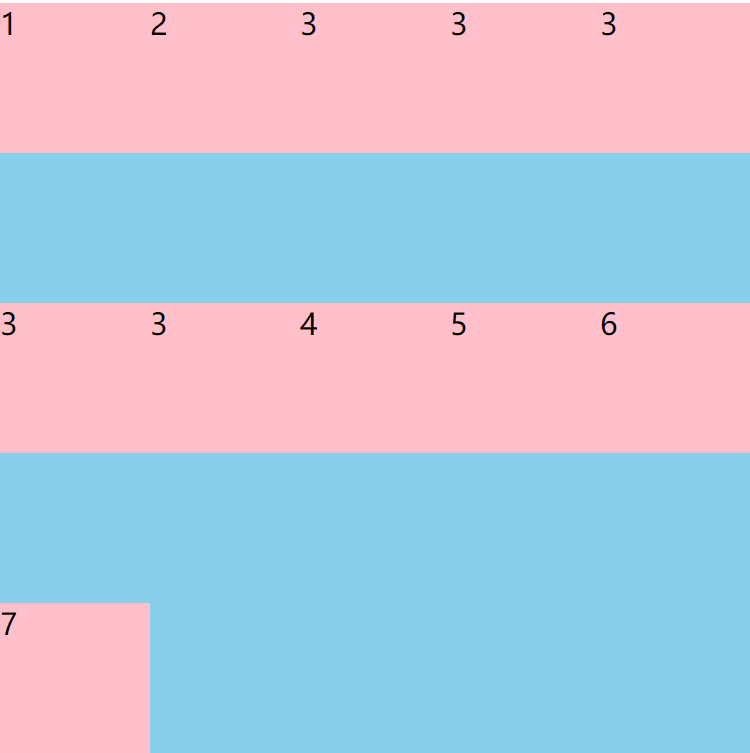

```css

align-content: space-evenly; // 垂直方向 子项间间距等大均分
```

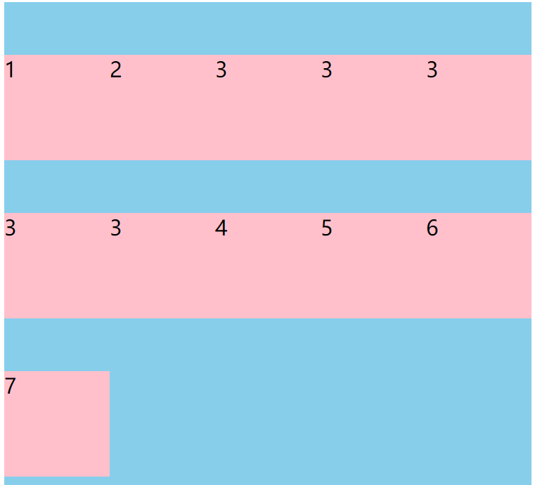


~~当不换行的情况下，align-items是不生效的，需要开启换行`flex-wrap: wrap`~~

`align-items`针对每一行的影响，例如在换行后，进行均分，相当于`justify-content： space-*`里的操作

```css
align-items: stretch; //默认，拉伸,在子元素未设置高度的情况下，与弹性元素高度对齐，
align-items: flex-start; // 每个子元素都在自己所在行的初始位置
align-items: flex-end; // 每个子元素都在自己所在行的最终位置
align-items: flex-center; // 等效于 align-content: center
align-items: baseline; // 以x作为底对齐
```


#### 内联与块的上下左右居中布局

要求弹性元素内容 上下左右 居中布局

```html
	<div class="main">
		测试文字
	</div>
```

##### 内联元素实现上下左右居中

**弹性布局实现上下左右居中**

```css
/*通过双轴居中方式控制内联元素居中*/
	.main{
		width: 500px;
		height: 500px;
		background: skyblue;
		display: flex;
		justify-content: center;  /*主轴居中*/
		align-items: center;   /* 交叉轴民中*/
	}
```

```css
/* 通过换行与整体居中实现上下左右居中 */
	.main{
		width: 500px;
		height: 500px;
		background: skyblue;
		display: flex;
		justify-content: center; /* 主轴居中 */
		flex-wrap: wrap;         /* 开启换行 */
		align-content: center;   /* 整体居中 */
	}
```

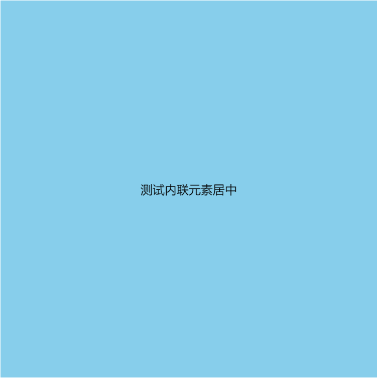

**通过行高实现1行居中**

不适用于多行广本

```css
width: 500px;
height: 500px;
background: skyblue;
line-height: 500px;
text-align: center;
```

**通过table-cell实现多行居中**

```css
width: 500px;
height: 500px;
background: skyblue;
display: table-cell;
vertical-align: middle;
```

#### 块元素实现上下左右居中

```html
	<div class="main">
		<div>测试块元素居中</div>
	</div>
```

**使用弹性布局实现上下左右居中**

```css

.main{
width: 500px;
height: 500px;
background-color: skyblue;
display: flex;
justify-content: center;   /* 主轴居中 */
align-items: center;     /* 交叉轴居中*/
}
.main div{
width: 100px;
height: 100px;
background: pink;
}
```

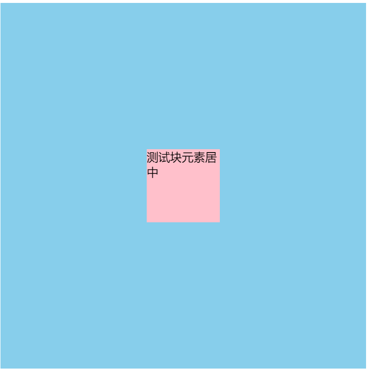

**使用定位实现上下左右居中**

```css
.main{
width: 500px;
height: 500px;
background-color: skyblue;
position: relative;
}
.main div{
width: 200px;
height: 100px;
background: pink;
position: absolute;
left: 50%;
top: 50%;
transform: translate(-50%,-50%);
}
```

**使用定位实现上下左右居中**

```css
.main{
width: 500px;
height: 500px;
background-color: skyblue;
position: relative;
}
.main div{
width: 200px;
height: 100px;
background: pink;
position: absolute;
left: 0;
top: 0;
bottom: 0;
right: 0;
margin: auto;
}
```


#### 不定向居中布局

不定向：盒子中的子元素数量不确定

```html
	<div class="main">
		<div>1</div>
		<div>2</div>
		<div>3</div>
		<div>4</div>
		<div>5</div>
		<div>6</div>
		<div>7</div>
		<div>8</div>
		<div>9</div>
	</div>
```

##### **弹性布局实现不定向居中**

```css
/* justify-content:center; 垂直居中
   align-items: center; 子项水平居中
*/
.main{
width: 500px;
height: 500px;
background-color: skyblue;
display: flex;
justify-content: center;
align-items: center;
}
.main div{
width: 30px;
height: 30px;
background: pink;
border-radius: 50%;
margin: 10px;
display: flex;
justify-content: center;
align-items: center;
}
```

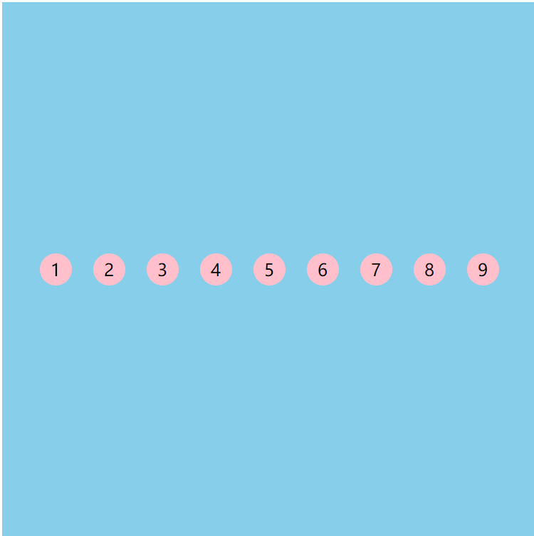

##### **使用定位实现不定向居中布局**

```html
	<div class="main">
	<section>
		<div>1</div>
		<div>2</div>
		<div>3</div>
		<div>4</div>
		<div>5</div>
		<div>6</div>
		<div>7</div>
		<div>8</div>
		<div>9</div>
	</section>
	</div>
```

```css
.main{
width: 500px;
height: 500px;
background-color: skyblue;
position: relative;
}
.main section {
position: absolute;
bottom: 0;
width: 100%;
text-align: center;
font-size: 0;
}
.main div{
width: 30px;
height: 30px;
background: pink;
border-radius: 50%;
margin: 10px;
display: inline-block;
line-height: 30px;
font-size: 20px;
}
```

#### 均分列布局

##### **弹性均分列布局**

```html
	<div class="main">
		<div>1</div>
		<div>2</div>
		<div>3</div>
		<div>4</div>
	</div>
```

```css
.main{
width: 500px;
height: 500px;
background-color: skyblue;
display: flex; /*定义弹性布局 */
justify-content: space-between; /* 指定主轴均分间隔到每个子元素 */
align-items: flex-end; /* 指定交叉轴位于弹性元素底部 */
padding: 0 20px;       
}
.main div{
width: 30px;
height: 30px;
background: pink;
border-radius: 50%;
margin: 10px;
display: flex;           /* 主要用于定义文本上下左右居中 */
justify-content: center;
align-items: center;
}
```

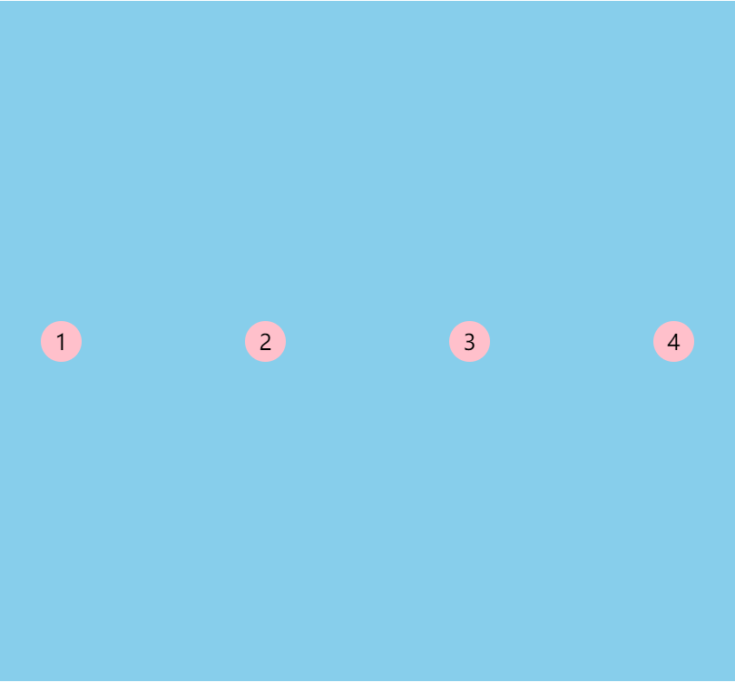

##### **使用固定定位实现均分列布局**

```html
	<div class="main">
		<section>
		<div>1</div>
		<div>2</div>
		<div>3</div>
		<div>4</div>
		<div>4</div>
		</section>
	</div>

```

```css
.main{
width: 500px;
height: 500px;
background-color: skyblue;
overflow: hidden;
border-size: border-box;
padding: 0 20px;
position: relative;
}
.main section{
width: 150%;
position: absolute;
bottom: 0;
}
.main div{
width: 30px;
height: 30px;
background: pink;
border-radius: 50%;
float: left;
text-align: center;
line-height: 30px;
margin: 0 77px 10px 0;
}
```

#### 子项分组布局

##### **嵌套的html结构实现子项分组布局**

```html
	<div class="main">
		<div class="left">1</div>
		<div class="right">
			<div class="box">2</div>
			<div class="box">3</div>
		</div>
	</div>
```

```css
.main{
width: 800px;
height: 500px;
background-color: skyblue;
display: flex;
justify-content: space-between;
align-content: center;
}
.left{
width: 300px;
}
.left,.right .box{
background-color: pink;
height: 100px;
display: flex;
align-items: center;
justify-content: center;
}
.right {
display: flex;
align-content: center;
}
.right .box{
width: 150px;
margin-left: 50px;
}
```

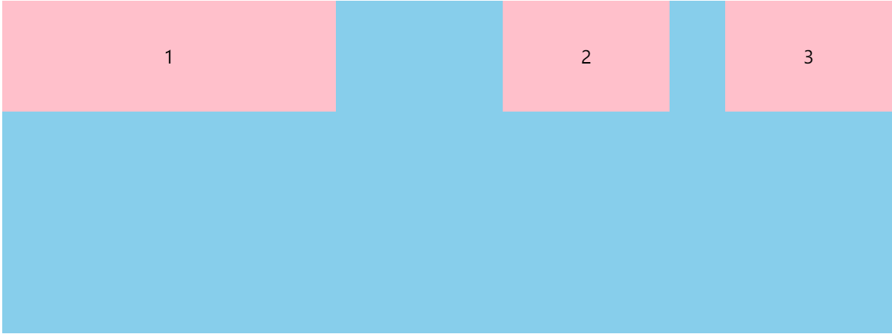

##### **简单html结构实现子项分组布局**

```html
	<div class="main">
	<div>1</div>
	<div>2</div>
	<div>3</div>
	<div>4</div>
	<div>5</div>
	<div>6</div>
	<div>7</div>
	<div>8</div>
	<div>9</div>
	</div>
```

```css
.main{
width: 800px;
height: 500px;
background-color: skyblue;
display: flex;
}
.main div{
	width: 50px;
	height: 100px;
	background-color: pink;
	margin-right: 10px;
	display: flex;
	align-items: center;
	justify-content: center;
}
.main div:nth-of-type(3){
	margin-right: auto;
}

.main div:nth-of-type(6){
	margin-right: auto;
}
```

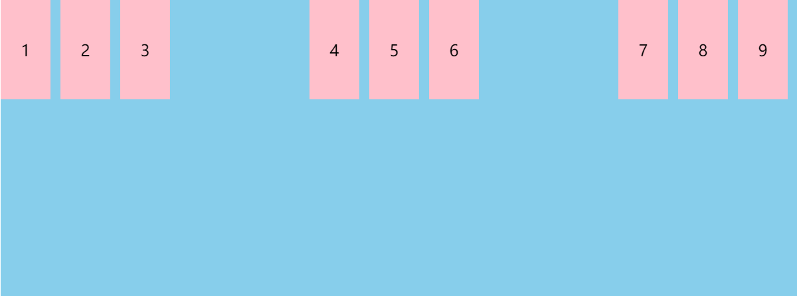


#### flex扩展比例

用于子项，并非用于弹性容器本身

```css
flex-grow: 0 // 默认值是0，表示不占用剩余的空白间隙扩展自己的宽度

flex-grow: 1 // 值为1，表示占用所有剩余空间来扩展自己的宽度

flex-grow: .5 // 值为.5，表示剩余空间*0.5，来扩容自己的宽度

flex-grow: 2 // 值为2, 即值大于等于1时，表示占用所有剩余空间来扩展自己的宽度，
```

##### 较简单的扩展比例

```html
	<div class="main">
	<div></div>
	</div>
```

```css
.main{
width: 500px;
height: 500px;
background-color: skyblue;
display: flex;
}
.main div{
width: 100px;
height: 100px;
background: pink;
flex-grow: .3;
}
```

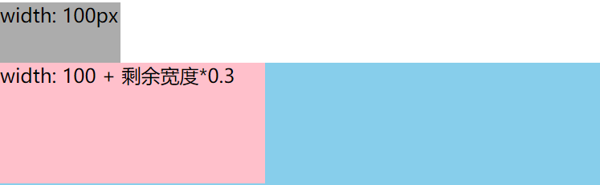


##### **较复杂的扩展比例**

```html
	<div class="main">
	<div>1</div>
	<div>2</div>
	<div>3</div>
	</div>
```

```css
.main{
width: 500px;
height: 500px;
background-color: skyblue;
display: flex;
}
.main div{
width: 100px;
height: 100px;
}
.main div:nth-of-type(1){
background: pink;
flex-grow: .2;
}
.main div:nth-of-type(2){
background-color: #a3c986;
flex-grow: 3;
}
.main div:nth-of-type(3){
background-color: #99a9a3;
}
```

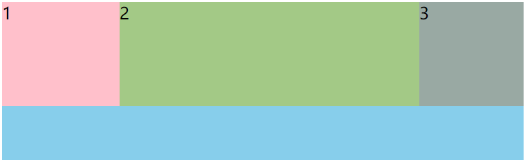


此处flex扩展，找gpt总结

#### flex收缩比例

当子项大于弹性容器时

```css
flex-shrink: 1; // 默认值是1，表示flex容器空间不虽足时，元素的收缩比例,自动收缩，与弹性容器相同

flex-shrink: 0; // 保持子项默认值，元素可能会超出弹性容器

flex-shrink: 0.5; // 将溢出空间的一半进行收缩
```

```html
	<div class="main">
	<div>1</div>
	<div>2</div>
	</div>
```

```css
.main{
width: 500px;
height: 500px;
background-color: skyblue;
display: flex;
}
.main div:nth-of-type(1){
width: 400px;
height: 100px;
background-color: #ccc;
flex-shrink: .5;
}
.main div:nth-of-type(2){
width: 400px;
height: 100px;
background-color: #999;
flex-shrink: .5;
}
```

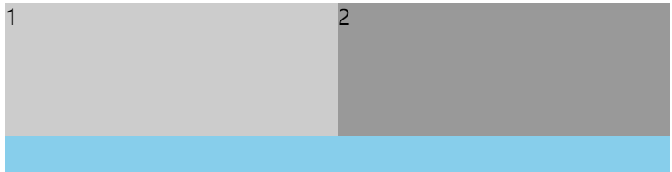

此处flex收缩，找gpt总结

#### flex-basis

```css
flex-basis: auto; //默认值是auto,指定了flex元素在主轴方向上的初始大小,如果没有设置主轴方向上的宽(高)，则会以内容的宽(高)为实际宽(高)
flex-basis: 200px; //在flex元素的主轴方向上，设置它的初始宽(高)
flex-basis: 100%; //在flex元素的主轴方向上，基于弹性元素设置它的初始宽(高)
```

#### flex缩写

flex属性是`flex-grow`，`flex-shrink`，`flex-basis`的缩写

```css
flex: flex-grow flex-shrink flex-basis

// 常用写法,默认写法
flex: 1 1 auto; 

flex: 1
flex-grow: 1;
flex-shrink: 1;
flex-basis: 0%


flex: 0;
flex-grow: 0;
flex-shrink: 1;
flex-basis: 0%;


flex: auto;
flex-grow: 1;
flex-shrink: 1;
flex-basis: auto;
```


#### order

```
// 默认值是0,改变某一个flex子项的排序位置
// 值越小，位置越优先
```

```html
	<div class="main">
	<div>1</div>
	<div>2</div>
	<div>3</div>
	<div>4</div>
	</div>
```

```css
.main{
width: 500px;
height: 500px;
background-color: skyblue;
display: flex;
}
.main div:nth-of-type(1){
order: 1;
}
.main div:nth-of-type(4){
order: -1;
}
.main div{
width: 100px;
height: 100px;
background-color: pink;
}
```

#### align-slef

```css
默认值是auto,控制单独某一个flex子项的垂直对齐方式,是会获取弹性容器的align-items的值，作用为默认值
同样也可以单独设置值
```

#### 等高布局

###### 弹性容器实现等高布局

```html
	<div class="main">
	<div class="left">
		<p>测试内容</p>
		<p>测试内容</p>
		<p>测试内容</p>
		<p>测试内容</p>
		<p>测试内容</p>
	</div>
	<div class="content">
		
	</div>
	<div class="right">
		<p>测试内容</p>
		<p>测试内容</p>
		<p>测试内容</p>
		<p>测试内容</p>
		<p>测试内容</p>
		<p>测试内容</p>
		<p>测试内容</p>
		<p>测试内容</p>
		<p>测试内容</p>
	</div>
	</div>
```

```css
.main{
width: 500px;
background-color: skyblue;
display: flex;

}
.main .left, .main .right{
	background-color: pink;
	width: 100px;
}
.main .left{

}
.main .content{
	flex-grow: 1;
}
.main .right{

}

```

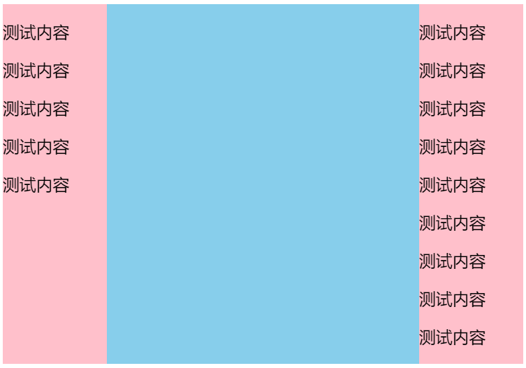

###### 常规布局实现等高布局

```html
	<div class="main">
	<div class="left">
		<p>测试内容</p>
		<p>测试内容</p>
		<p>测试内容</p>
		<p>测试内容</p>
		<p>测试内容</p>
	</div>
	<div class="content">
		
	</div>
	<div class="right">
		<p>测试内容</p>
		<p>测试内容</p>
		<p>测试内容</p>
		<p>测试内容</p>
		<p>测试内容</p>
		<p>测试内容</p>
		<p>测试内容</p>
		<p>测试内容</p>
		<p>测试内容</p>
	</div>
	</div>
```

```css
body{
margin: 0;
}
.main{
height: 100vh;
background-color: skyblue;
display: flex;
}
.left{
width: 200px;
background-color: #333;
}
.right{
flex-grow: 1;
background-color: #999;
}
.main{
width: 500px;
background-color: skyblue;
overflow: hidden;
}
.main .left, .main .right{
	background-color: pink;
	width: 100px;
	float: left;
	margin-bottom: -2000px;
	padding-bottom: 2000px;
}
.main .left{

}
.main .left::after{
content: "";
clear: both;
display: block;
}

.main .content{
width: 300px;
height: 500px;
background-color: #999;
float: left;
}

.main .content::after{
conbody{
margin: 0;
}
.main{
height: 100vh;
background-color: skyblue;
display: flex;
}
.left{
width: 200px;
background-color: #333;
}
.right{
flex-grow: 1;
background-color: #999;
}
tent: "";
clear: both;
display: block;
}
.main .right{
	float: right;
}

```

#### 两列布局

###### 弹性容器实现两列布局

```html
<div class="main">
	<div class="left"></div>
	<div class="right"></div>
</div>
```

```css
body{
margin: 0;
}
.main{
height: 100vh;
background-color: skyblue;
display: flex;
}
.left{
width: 200px;
background-color: #333;
}
.right{
flex-grow: 1;
background-color: #999;
}
```

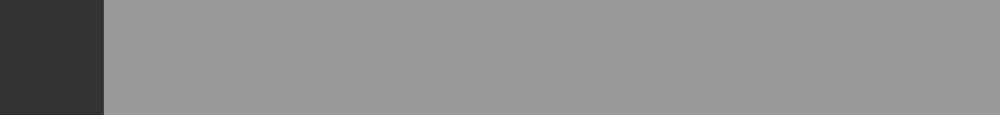

###### 常规布局实现两列布局

```html
<div class="main">
	<div class="left"></div>
	<div class="right"></div>
</div>
```

```css
body{
margin: 0;
}
.main{
height: 100vh;
background-color: skyblue;
display: block;
}
.left{
height: 90%;
width: 200px;
float: left;
background-color: #333;
}
.right{
height: 100%;
background-color: #999;
margin-left: 200px;
overflow: hidden;
}
```


#### 三列布局

```html
<div class="main">
	<div class="left"></div>
	<div class="content"></div>
	<div class="right"></div>
</div>
```

```css
body{
margin: 0;
}
.main{
height: 100vh;
background-color: skyblue;
display: flex;
}
.left{
width: 200px;
background-color: #333;
}
.content{
flex-grow: 1;
background-color: #666;
}
.right{
width: 200px;
background-color: #999;
}
```

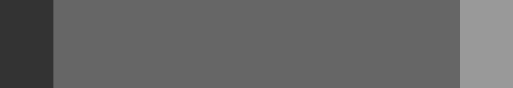

#### sticky Footer布局

粘性页脚布局

```html
<div class="main">
	<div class="header"></div>
	<div class="content">
		<p>测试内容</p>
		<p>测试内容</p>
	</div>
	<div class="footer"></div>
</div>
```

```css
body{
margin: 0;
}
.main{
min-height: 100vh;
background-color: skyblue;
display: flex;
flex-direction: column;
}
.main .header{
height: 100px;
background-color: #ccc;
}

.main .content{
flex-grow: 1;
background-color: #999;
}

.main .footer{
height: 100px;
background-color: #333;
}
```

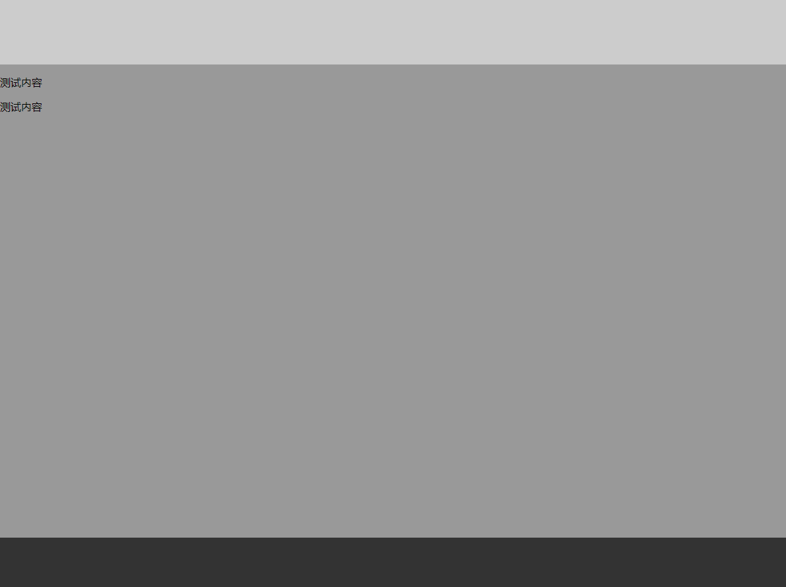

#### 溢出项布局

```html
<div class="main">
	<div>1</div>
	<div>2</div>
	<div>3</div>
	<div>4</div>
	<div>5</div>
	<div>6</div>
	<div>7</div>
	<div>8</div>
</div>

```

```css
body{
margin: 0;
}
.main{
width: 500px;
height: 200px;
background-color: skyblue;
display: flex;
-ms-align-items: center;
align-items: center;
}

.main div{
width: 100px;
height: 100px;
background-color: pink;
flex-shrink: 0;
margin-right: 10px;
}
```

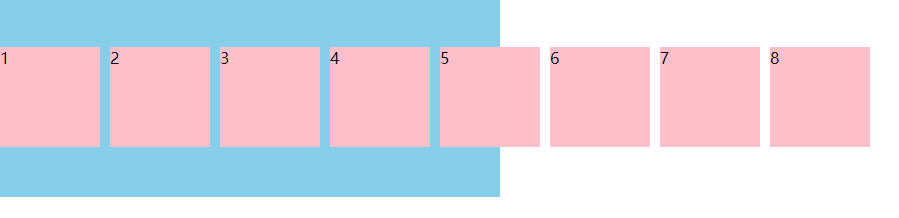

