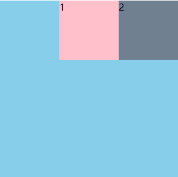

#### grid网格

css网格是一个用于web的二维布局系统。利用网格，你可以把内容按照行与列的格式进行排版。另外，网格还能非常轻松地实现一些复杂布局

`grid-template-rows`,`grid-template-columns`基于网格行和列的维度,去定义网格线的名称和网格轨道的尺寸大小

fr（fraction unit，分数单位）是一种用于定义网格轨道（行或列）大小的单位，它表示可用空间的比例。与 px、% 等绝对或相对单位不同，fr 是基于剩余空间的比例进行分配的。

**定义网格及fr单位**

```html
	<div class="main">
		<div>1</div>
		<div>2</div>
		<div>3</div>
		<div>4</div>
		<div>5</div>
		<div>6</div>
		<div>7</div>
		<div>8</div>
		<div>9</div>
	</div>
```

```css
.main{
	width: 300px;
	height: 300px;
	background-color: skyblue;
	display: grid;
	grid-template-columns: 100px 100px 100px; /*表示有3列，每列宽度为100px*/
	grid-template-rows: 100px 100px 100px;  /*表示有3行，每行高度为100px;*/
	
}
.main div{
	background-color: pink;
}
```


```css
.main{
	width: 300px;
	height: 300px;
	background-color: skyblue;
	display: grid;
	grid-template-columns: 50px 20% auto; /*表示有3列，第一列宽50px;第二列宽占网络容器的20%宽度，第三列占满剩余宽度*/
	grid-template-rows: 50px 50px;  /*表示2行，第一行高50px;第二行高50px，第三行高占用剩余宽度*/
	
}
.main div{
	background-color: pink;
}
```


```css
.main{
	width: 300px;
	height: 300px;
	background-color: skyblue;
	display: grid;
	grid-template-columns: 1fr 1fr 1fr; /* 均分三列 */
	grid-template-rows: 1fr 1fr 1fr;  /* 均分三行 */	
}
.main div{
	background-color: pink;
}
```


#### 合并网格及网格命名

使用命名方式定义网络区域，需要配合`grid-area`属性进行使用

```html
	<div class="main">
		<div>1</div>
		<div>2</div>
		<div>3</div>
	</div>
```

```css
.main{
	width: 300px;
	height: 300px;
	background-color: skyblue;
	display: grid;
	grid-template-columns: 1fr 1fr 1fr; /* 均分三列 */
	grid-template-rows: 1fr 1fr 1fr;  /* 均分三行 */
	grid-template-areas:
	"a1 a1 a2"
	"a1 a1 a2"
	"a3 a3 a3"
	;
    /* 配合grid-area名字使用后，div占用情况如模板所示 */
}
.main div{
	background-color: pink;
	border: 1px solid #000;
	box-sizing: border-box;
}

.main div:nth-of-type(1){
	grid-area: a1;
}
.main div:nth-of-type(2){
	grid-area: a2;
}
.main div:nth-of-type(3){
	grid-area: a3;
}
```


```html
	<div class="main">
		<div>1</div>
		<div>2</div>
		<div>3</div>
	</div>
```
网格子项移动
```css
.main{
	width: 300px;
	height: 300px;
	background-color: skyblue;
	display: grid;
	grid-template-columns: 1fr 1fr 1fr; /* 均分三列 */
	grid-template-rows: 1fr 1fr 1fr;  /* 均分三行 */
	grid-template-areas:
	"a1 a2 a3"
	;
    /* 如果指定第一个子项为a3，则第一个子项移动到第3个位置，其余位置移动依次前移 */
}
.main div{
	background-color: pink;
	border: 1px solid #000;
	box-sizing: border-box;
}

.main div:nth-of-type(1){
	grid-area: a3;
}
```


##### 网格命名缩写

```html
	<div class="main">
		<div>1</div>
		<div>2</div>
		<div>3</div>
	</div>
```

```css
.main{
	width: 300px;
	height: 300px;
	background-color: skyblue;
	display: grid;
    /*使用了简写的grid-template属性来定义网格的行高和列布局,同时设置区域名*/
    /*行高和列宽均为1fr,表示所有行和列均匀分布*/
    /* 在模板中,前两行的前两列是a1区域,2*2,右上角单元格是a2区域1*2,最后一行单元格为a3区域3*1 */
	grid-template:
	"a1 a1 a2" 1fr
	"a1 a1 a2" 1fr
	"a3 a3 a3" 1fr
   /1fr 1fr 1fr
    ;	
}
.main div{
	background-color: pink;
	border: 1px solid #000;
	box-sizing: border-box;
}

.main div:nth-of-type(1){
	grid-area: a1;
}
.main div:nth-of-type(2){
	grid-area: a2;
}
.main div:nth-of-type(3){
	grid-area: a3;
}
```


#### 网格间隙及简写

用来设置元素行列之间的间隙大小，推荐使用`row-gap`,``column-gap`,`gap`

```html
	<div class="main">
		<div>1</div>
		<div>2</div>
		<div>3</div>
	</div>
```

```css
.main{
	width: 300px;
	height: 300px;
	background-color: skyblue;
	display: grid;
	grid-template:
	"a1 a1 a2" 1fr
	"a1 a1 a2" 1fr
	"a3 a3 a3" 1fr
   /1fr 1fr 1fr
    ;
    grid-row-gap: 20px;  /*行间距,*/
    grid-column-gap: 30px; /*列间距*/

    row-gap: 20px; /*行间距,推荐写法 */
    column-gap: 30px; /*列间距,推荐写法*/

    grid-gap: 20px 30px;/*行列间距，共同写法*/

}
.main div{
	background-color: pink;
	border: 1px solid #000;
	box-sizing: border-box;
}

.main div:nth-of-type(1){
	grid-area: a1;
}
.main div:nth-of-type(2){
	grid-area: a2;
}
.main div:nth-of-type(3){
	grid-area: a3;
}
```


这里说flex也可以实现`row-gap`，`column-gap`，发现并不能，可能和浏览器版本相关

```html
<div class="main2">
		<div>1</div>
		<div>2</div>
		<div>3</div>
		<div>4</div>
		<div>5</div>
		<div>6</div>
		<div>7</div>
	</div>
```


```css

.main2 {
	margin-top: 50px;
	width: 300px;
	height: 300px;
	background-color: skyblue;
	display: flex;
	flex-wrap: wrap;
	row-gap: 20px;
	column-gap: 30px;
}
.main2 div{
	width: 50px;
	height: 100px;
	background-color: pink;
}
```


#### 网格子元素对齐方式及简写

默认值`stretch`，指定了子项在网络中的对齐方式

```html
	<div class="main">
	<div>1</div>
	<div>2</div>
	<div>3</div>
	<div>4</div>
	<div>5</div>
	<div>6</div>
	<div>7</div>
	<div>8</div>
	<div>9</div>
	</div>
```

```css
.main{
	width: 300px;
	height: 300px;
	background-color: skyblue;
	display: grid;
	grid-template:
	"a1 a2 a3" 1fr
	"a4 a5 a6" 1fr
	"a7 a8 a9" 1fr
   /1fr 1fr 1fr
	;
    
    justify-items: start;  /* 默认值,单元格内容水平居左 */
	align-items: start;    /* 默认值,单元格内容垂直居上 */
    
    justify-items: center;  /* 单元格内容水平居中 */
	align-items: center;    /* 单元格内容垂直居中 */


    justify-items: end;  /* 单元格内容水平居右 */
	align-items: end;    /* 单元格内容垂直居下 */

    /* 网络对齐缩写 */
	place-items: start end; /* 第一个是垂直方向，第二个是平行方向 */

}
.main div{
	width: 50px;
	height: 50px;
	background-color: pink;
	border: 1px solid #000;
}
```


#### 网格元素对齐方式及简写

找gpt再学习下，未能讲清楚

默认值是stretch,指定所有网格在grid容器中的对齐方式

```html
	<div class="main">
	<div>1</div>
	<div>2</div>
	<div>3</div>
	<div>4</div>
	<div>5</div>
	<div>6</div>
	<div>7</div>
	<div>8</div>
	<div>9</div>
	</div>
```


```css
.main{
	width: 500px;
	height: 500px;
	background-color: skyblue;
	display: grid;
	grid-template:
	"a1 a2 a3" 1fr
	"a4 a5 a6" 1fr
	"a7 a8 a9" 1fr
   /1fr 1fr 1fr
	;
	/*justify-content: stretch; /* 默认拉伸元素 */
	align-content: space-around;
}
.main div{
	width: 50px;
	/*height: 50px;*/
	background-color: pink;
	border: 1px solid #000;
}
```


#### 基于线的元素放置

表示grid子项所占据的区域的起始和终止位置，包括水平方向垂直方向

```html
	<div class="main">
	<div>1</div>
	</div>
```

```css
.main{
	width: 300px;
	height: 300px;
	background-color: skyblue;
	display: grid;
	grid-template:
	"a1 a2 a3" 1fr
	"a4 a5 a6" 1fr
	"a7 a8 a9" 1fr
   /1fr 1fr 1fr
	;
}
.main div:nth-of-type(1){
	background-color: pink;
	grid-column-start: 2; /* 从哪列开始 */
	grid-column-end: 3;  /* 到哪列结束 */
	grid-row-start: 2;  /* 从哪行开始 */
	grid-row-end: 4;   /* 到哪行结束 */
    /* 这整个范围就是这个单元格的大小 */
}
```


多个子元素的位置放置方式

###### 指定初始终点位置

```html
	<div class="main">
	<div>1</div>
	<div>2</div>
	</div>
```

```css
.main{
	width: 300px;
	height: 300px;
	background-color: skyblue;
	display: grid;
	grid-template:
	"a1 a2 a3" 1fr
	"a4 a5 a6" 1fr
	"a7 a8 a9" 1fr
   /1fr 1fr 1fr
	;
}
.main div:nth-of-type(1){
	background-color: pink;
	grid-column-start: 2;
	grid-column-end: 3;
	/*grid-row-start: 2;*/
	/*grid-row-end: 4;*/
}

.main div:nth-of-type(2){
	background-color: slategray;
	grid-column-start: 3;
	grid-column-end: 4;
	/*grid-row-start: 2;*/
	/*grid-row-end: 4;*/
}
```


###### 使用span方式指定行列数量

```html
	<div class="main">
	<div>1</div>
	</div>
```

```css
.main{
	width: 300px;
	height: 300px;
	background-color: skyblue;
	display: grid;
	grid-template:
	"a1 a2 a3" 1fr
	"a4 a5 a6" 1fr
	"a7 a8 a9" 1fr
   /1fr 1fr 1fr
	;
}
.main div:nth-of-type(1){
	background-color: pink;
	grid-column-start: 2;
	grid-column-end: span 2; /* span 表示占用列 2表示占用两列 */
	}
```


###### 使用列线名称

```html
	<div class="main">
	<div>1</div>
	</div>
```

```css
.main{
	width: 300px;
	height: 300px;
	background-color: skyblue;
	display: grid;
	grid-template-columns: [col1] 1fr [col2] 1fr [col3] 1fr [col4];  /* 定义列线名称 */
	grid-template-rows: [row1] 1fr [row2] 1fr [row3] 1fr [row4];     /* 定义横线名称 */
}
.main div:nth-of-type(1){
	background-color: pink;
	grid-column-start: col1; /* 引用列线名称*/
	grid-column-end: col3;  /* 引用列线名称 */
	}
```

###### 简写方式

```html
	<div class="main">
	<div>1</div>
	</div>
```

```css
.main{
	width: 300px;
	height: 300px;
	background-color: skyblue;
	display: grid;
	grid-template-columns: [col1] 1fr [col2] 1fr [col3] 1fr [col4];  /* 定义列线名称 */
	grid-template-rows: [row1] 1fr [row2] 1fr [row3] 1fr [row4];     /* 定义横线名称 */
}
.main div:nth-of-type(1){
	background-color: pink;
	grid-column: 2/3; /* 起始列/终止列 */
	grid-row: 2/3; /* 起始行/终止行 */
	grid-area: 2/2/3/3; /* 等效于下面示例 */	
    /*
    grid-row-start: 2;
    grid-column-start: 2;
    grid-row-end: 3;
    grid-column-end: 3;  
    */
}
```

#### 子项对齐方式

```css
justify-self: center;
align-self: center;
```


#### 左导航示例

```bash
目标要求,左导航,鼠标移入,右侧显示
先说明html布局
1. div中设置 div>ul>li>a 导航栏
2. 在li>a+ul>li>a+img,在导航栏 li>a的同级目录下设置默认隐藏的ul>li内容
3. 对默认的ul>li>a+img,在导航栏上设置css属性
再说明css排版思路
1.设置导航,宽高固定,背景,flex一行
2.设置div>ul,ul>li,占满一行
3.设置div>ul,相对定位
4.设置div>ul>li>ul,绝对定位
5.设置div>ul>li>ul,grid排版
```

```html
    <div class="nav">
        <ul class="item">
            <li>
                <a href="#">手机 电话卡</a><i class="iconfont icon-right-arrow"></i>
                <ul class="card">
                    <li>
                        
                        <p>小米 MIX FOLD</p>
                    </li>
                    <li>
                        
                        <p>小米 MIX FOLD</p>
                    </li>
                    <li>
                        
                        <p>小米 MIX FOLD</p>
                    </li>
                    <li>
                        
                        <p>小米 MIX FOLD</p>
                    </li>
                    <li>
                        
                        <p>小米 MIX FOLD</p>
                    </li>
                </ul>
            </li>
            <li>
                <a href="#">笔记本 显示器 平板</a><i class="iconfont icon-right-arrow"></i>
                <ul class="card">
                    <li>
                        
                        <p>小米 MIX FOLD</p>
                    </li>
                    <li>
                        
                        <p>小米 MIX FOLD</p>
                    </li>
                    <li>
                        
                        <p>小米 MIX FOLD</p>
                    </li>
                    <li>
                        
                        <p>小米 MIX FOLD</p>
                    </li>
                    <li>
                        
                        <p>小米 MIX FOLD</p>
                    </li>
                    <li>
                        
                        <p>小米 MIX FOLD</p>
                    </li>
                    <li>
                        
                        <p>小米 MIX FOLD</p>
                    </li>
                    <li>
                        
                        <p>小米 MIX FOLD</p>
                    </li>
                    <li>
                        
                        <p>小米 MIX FOLD</p>
                    </li>
                    <li>
                        
                        <p>小米 MIX FOLD</p>
                    </li>
                    <li>
                        
                        <p>小米 MIX FOLD</p>
                    </li>
                </ul>
            </li>
            <li>
                <a href="#">手机 电话卡</a><i class="iconfont icon-right-arrow"></i>
                <ul class="card">
                    <li>
                        
                        <p>小米 MIX FOLD</p>
                    </li>
                    <li>
                        
                        <p>小米 MIX FOLD</p>
                    </li>
                    <li>
                        
                        <p>小米 MIX FOLD</p>
                    </li>
                    <li>
                        
                        <p>小米 MIX FOLD</p>
                    </li>
                    <li>
                        
                        <p>小米 MIX FOLD</p>
                    </li>
                    <li>
                        
                        <p>小米 MIX FOLD</p>
                    </li>
                    <li>
                        
                        <p>小米 MIX FOLD</p>
                    </li>
                    <li>
                        
                        <p>小米 MIX FOLD</p>
                    </li>
                    <li>
                        
                        <p>小米 MIX FOLD</p>
                    </li>
                    <li>
                        
                        <p>小米 MIX FOLD</p>
                    </li>
                    <li>
                        
                        <p>小米 MIX FOLD</p>
                    </li>
                </ul>
            </li>
            <li><a href="#">笔记本 显示器 平板</a><i class="iconfont icon-right-arrow"></i></li>
            <li><a href="#">手机 电话卡</a><i class="iconfont icon-right-arrow"></i></li>
            <li><a href="#">笔记本 显示器 平板</a><i class="iconfont icon-right-arrow"></i></li>
        </ul>
    </div>
```

```css

        .nav{
            display: flex;
            background-color: #ccc;
            height: 100vh;
            width: 200px;
            box-sizing: border-box;
        }
        .nav>.item{
            display: flex;
            width: 100%;
            flex-direction: column;
            box-sizing: border-box;
            position: relative;
        }
        .nav .item>li{
            width: 100%;
            line-height: 32px;
            padding: 10px;
            box-sizing: border-box;
            color: #fff;
            background-color: #333;
            /*border: 1px solid red;*/
            display: flex;
            justify-content: space-between;
            cursor: pointer;
            /*position: relative;*/
        }
        .nav .item>li:hover{
            background-color: #f3ae24;
        }
        .nav .item>li i{
            /*border: 1px solid #000;*/
            padding-right: 20px;
        }
        .nav .item>li a{
            color: #fff;
            /*border: 1px solid #000;*/
        }
        .nav .item>li:hover .card{
            display: grid;

        }
        .nav .item .card{
            display: none;
            position: absolute;
            top: 0;
            left: 100%;
            /*display: grid;*/
            grid-template-rows: repeat(6, 1fr);
            grid-template-columns: 305px;
            grid-auto-flow: column;
            height: 460px;
            box-shadow: 5px 5px 10px #ccc;
        }
        .nav .item .card li{
            width: 300px;
            color: #333;
            display: flex;
            align-items: center;
        }
        .nav .item .card li img{
            margin-left:26px;
            margin-right:21px;
        }
```